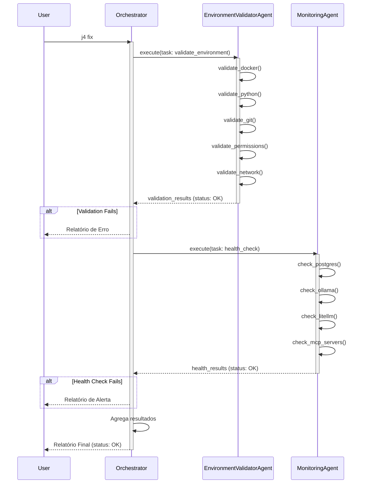

# Documentação Completa dos Agentes Atômicos do .J.4.R.V.1.5.

> **Versão 3.5.0** | **Autor**: B0.y_Z4kr14 | **Data**: Dezembro 2024

---

## Índice

1. [SystemDetectorAgent](#1-systemdetectoragent)
2. [SecurityAgent](#2-securityagent)
3. [LLMManagerAgent](#3-llmmanageragent)
4. [EnvironmentValidatorAgent](#4-environmentvalidatoragent)
5. [MonitoringAgent](#5-monitoringagent)
6. [ConfigurationAgent](#6-configurationagent)
7. [Diagrama de Sequência UML](#7-diagrama-de-sequência-uml)

---

## 1. SystemDetectorAgent

**Responsabilidade**: Coletar inventário completo do hardware, software e ambiente de rede.

**Prompt de Exemplo**:
```json
{
  "task": {
    "action": "detect",
    "target": "all"
  },
  "description": "Execute uma detecção completa do sistema, incluindo hardware (CPU, GPU, RAM, disco), sistema operacional (distribuição, kernel), rede (IPs, DNS, velocidade) e ambiente de shell (bash, zsh, fish)."
}
```

**Saída Esperada**:
```json
{
  "hardware": {
    "cpu": {
      "model": "Intel Core i9-12900K",
      "cores": 16,
      "threads": 24,
      "arch": "x86_64"
    },
    "gpu": {
      "model": "NVIDIA GeForce RTX 4090",
      "vram_gb": 24,
      "driver": "535.104.05"
    }
  }
}
```

**Ferramentas Utilizadas**:

| Tipo | Ferramenta | Propósito |
| :--- | :--- | :--- |
| **Python** | `psutil` | Obter informações de hardware (CPU, RAM, disco). |
| | `platform` | Obter informações do sistema operacional. |
| | `socket` | Obter informações de rede. |
| | `shutil` | Verificar espaço em disco. |
| | `os` | Interagir com o sistema operacional. |
| | `subprocess` | Executar comandos de shell. |
| **Shell** | `uname` | Obter informações do kernel. |
| | `lsb_release` | Obter informações da distribuição Linux. |
| | `lscpu` | Obter informações detalhadas da CPU. |
| | `nvidia-smi` | Obter informações da GPU NVIDIA. |
| | `speedtest-cli` | Testar a velocidade da internet. |

---

## 2. SecurityAgent

**Responsabilidade**: Gerenciar de forma segura todo o ciclo de vida de credenciais, chaves de API, tokens e chaves criptográficas.

**Prompt de Exemplo**:
```json
{
  "task": {
    "action": "import_secrets",
    "source_file": "/path/to/.env.J.4.R.V.1.5",
    "master_key": "your-super-secret-master-key"
  },
  "description": "Leia o arquivo '.env.J.4.R.V.1.5'. Para cada variável, criptografe seu valor usando a chave mestra fornecida e armazene o resultado em um arquivo seguro. Importe as chaves SSH para '~/.ssh/' e as chaves GPG para o chaveiro GPG."
}
```

**Saída Esperada**:
```json
{
  "status": "SUCCESS",
  "imported_secrets": ["ANTHROPIC_API_KEY", "OPENAI_API_KEY"],
  "imported_ssh_keys": ["id_ed25519", "id_ed25519.pub"],
  "imported_gpg_keys": 1
}
```

**Ferramentas Utilizadas**:

| Tipo | Ferramenta | Propósito |
| :--- | :--- | :--- |
| **Python** | `cryptography.fernet` | Criptografar e descriptografar tokens de API com AES-256-GCM. |
| | `shutil` | Copiar arquivos de chaves SSH. |
| | `os` | Aplicar permissões restritivas (`chmod 600`). |
| | `subprocess` | Executar comandos de importação de chaves. |
| **Shell** | `chmod` | Aplicar permissões em arquivos. |
| | `gpg --import` | Importar chaves GPG. |
| | `ssh-add` | Adicionar chaves SSH ao ssh-agent. |
| | `chown` | Alterar o proprietário de arquivos. |

**Detalhes de Segurança**:
- **Chaves SSH**: 4 passos (cópia segura, permissões `chmod 600`, symlink, adição ao ssh-agent)
- **Tokens API**: 4 passos (geração de chave mestra Fernet, criptografia, armazenamento em `env.encrypted`, descriptografia em memória)

---

## 3. LLMManagerAgent

**Responsabilidade**: Gerenciar o ciclo de vida dos modelos de linguagem, adaptando-se entre versões GPU e CPU.

**Prompt de Exemplo**:
```json
{
  "task": {
    "action": "setup_llm",
    "hardware_context": {
      "gpu_available": true,
      "gpu_vram_gb": 24,
      "cpu_cores": 16,
      "ram_gb": 64
    }
  },
  "description": "Com base no hardware detectado, selecione e baixe os modelos Ollama apropriados (GPU ou CPU). Gere o arquivo de configuração do LiteLLM integrando os modelos locais e as APIs remotas (OpenAI, Anthropic, Groq)."
}
```

**Saída Esperada**:
```json
{
  "status": "SUCCESS",
  "selected_tier": "GPU_LARGE",
  "downloaded_models": ["llama3.2:latest", "qwen2.5-coder:latest"],
  "litellm_config_path": "~/.J.4.R.V.1.5/30_llm_gateway/config.yaml"
}
```

**Ferramentas Utilizadas**:

| Tipo | Ferramenta | Propósito |
| :--- | :--- | :--- |
| **Python** | `psutil` | Detectar hardware (GPU, CPU, RAM). |
| | `subprocess` | Executar comandos Ollama. |
| | `yaml` | Gerar arquivo de configuração do LiteLLM. |
| | `requests` | Testar conectividade com APIs remotas. |
| **Shell** | `ollama pull` | Baixar modelos de linguagem. |
| | `docker-compose up` | Iniciar serviços do LiteLLM. |
| | `curl` | Testar endpoints de API. |

---

## 4. EnvironmentValidatorAgent

**Responsabilidade**: Validar se todas as dependências críticas do sistema estão presentes, acessíveis e com as versões corretas.

**Prompt de Exemplo**:
```json
{
  "task": {
    "action": "validate_environment",
    "targets": ["docker", "python", "git", "permissions", "network"]
  },
  "description": "Execute uma validação completa do ambiente. Verifique se o Docker está instalado e rodando, se a versão do Python é >= 3.9, se o Git está instalado, se o usuário atual possui permissões de administrador (root/sudo) e se há conectividade com a internet."
}
```

**Saída Esperada**:
```json
{
  "overall_status": "NEEDS_ATTENTION",
  "validation_results": [
    {
      "component": "Docker",
      "status": "OK",
      "details": "Docker Engine v26.1.3 está em execução."
    },
    {
      "component": "Python",
      "status": "OK",
      "details": "Python 3.11.0rc1 encontrado."
    },
    {
      "component": "Git",
      "status": "OK",
      "details": "Git v2.34.1 encontrado."
    },
    {
      "component": "Permissions",
      "status": "NEEDS_ATTENTION",
      "details": "O usuário 'ubuntu' não tem permissões de root. Ações que exigem 'sudo' podem falhar."
    },
    {
      "component": "Network",
      "status": "OK",
      "details": "Conectividade com 'google.com' estabelecida com sucesso."
    }
  ]
}
```

**Ferramentas Utilizadas**:

| Tipo | Ferramenta | Propósito |
| :--- | :--- | :--- |
| **Python** | `shutil.which()` | Localizar o caminho de executáveis (ex: `docker`, `git`). |
| | `subprocess.run()` | Executar comandos para obter versões (ex: `python --version`). |
| | `os.geteuid()` | Verificar se o ID do usuário efetivo é 0 (root). |
| | `socket` | Tentar estabelecer uma conexão TCP para validar a rede. |
| **Shell** | `docker --version` | Obter a versão do Docker. |
| | `python3 --version` | Obter a versão do Python. |
| | `git --version` | Obter a versão do Git. |
| | `id -u` | Obter o ID do usuário. |
| | `ping -c 1` | Testar a conectividade de rede básica. |

---

## 5. MonitoringAgent

**Responsabilidade**: Realizar verificações de saúde ativas em todos os serviços e componentes vitais do ecossistema `.J.4.R.V.1.5.`.

**Prompt de Exemplo**:
```json
{
  "task": {
    "action": "health_check",
    "targets": ["postgres", "ollama", "litellm", "mcp_servers"]
  },
  "description": "Execute uma verificação de saúde completa em todos os serviços. Teste a conexão com o banco de dados PostgreSQL, verifique se a API do Ollama está respondendo, teste o gateway do LiteLLM e valide a conectividade com os servidores MCP configurados."
}
```

**Saída Esperada**:
```json
{
  "overall_status": "OK",
  "health_results": [
    {
      "service": "PostgreSQL",
      "status": "OK",
      "details": "Conexão estabelecida com sucesso.",
      "latency_ms": 15
    },
    {
      "service": "Ollama API",
      "status": "OK",
      "details": "API respondeu com status 200 OK.",
      "latency_ms": 50
    },
    {
      "service": "LiteLLM Gateway",
      "status": "OK",
      "details": "Gateway respondeu com status 200 OK.",
      "latency_ms": 120
    },
    {
      "service": "MCP Servers",
      "status": "OK",
      "details": "Todos os 3 servidores MCP configurados estão respondendo.",
      "latency_ms": 250
    }
  ]
}
```

**Ferramentas Utilizadas**:

| Tipo | Ferramenta | Propósito |
| :--- | :--- | :--- |
| **Python** | `psycopg2` | Conectar ao banco de dados PostgreSQL para validar a conexão. |
| | `requests` | Fazer requisições HTTP para os endpoints de saúde das APIs (Ollama, LiteLLM, MCP). |
| | `time.time()` | Calcular a latência das respostas das APIs. |
| | `subprocess.run()` | Executar comandos de verificação de saúde via shell. |
| **Shell** | `pg_isready` | Utilitário do PostgreSQL para verificar o status do servidor de banco de dados. |
| | `curl` | Ferramenta de linha de comando para fazer requisições HTTP e verificar a saúde de serviços web. |
| | `docker ps` | Listar contêineres em execução para garantir que os serviços estão ativos. |

---

## 6. ConfigurationAgent

**Responsabilidade**: Gerenciar a configuração dinâmica do sistema `.J.4.R.V.1.5.`, permitindo que os usuários personalizem o comportamento dos agentes, modelos e ferramentas.

**Prompt de Exemplo**:
```json
{
  "task": {
    "action": "set_config",
    "key": "llm.default_model",
    "value": "llama3.2"
  },
  "description": "Defina o modelo de linguagem padrão para ser 'llama3.2'."
}
```

**Saída Esperada**:
```json
{
  "status": "SUCCESS",
  "key": "llm.default_model",
  "old_value": "qwen2.5-coder",
  "new_value": "llama3.2"
}
```

**Ferramentas Utilizadas**:

| Tipo | Ferramenta | Propósito |
| :--- | :--- | :--- |
| **Python** | `yaml` | Ler e escrever arquivos de configuração YAML. |
| | `json` | Ler e escrever arquivos de configuração JSON. |
| | `configparser` | Ler e escrever arquivos de configuração INI. |
| **Shell** | `j4 config` | Interface de linha de comando para interagir com o agente. |

---

## 7. Diagrama de Sequência UML

O diagrama abaixo ilustra a interação entre o `EnvironmentValidatorAgent` e o `MonitoringAgent` durante a inicialização do sistema `.J.4.R.V.1.5.`.



---

**Versão**: 3.5.0  
**Data**: Dezembro 2024  
**Autor**: B0.y_Z4kr14 (Documentação por Manus AI)  
**Projeto**: .J.4.R.V.1.5. - Axiomatic Multi-LLM Orchestration Platform
